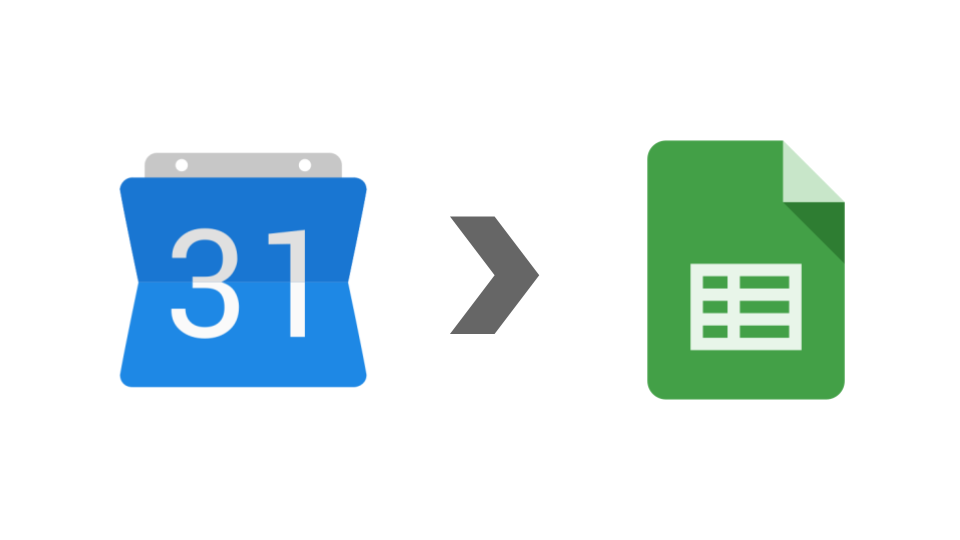

# gcal-history

## 概要

Google Calendarのイベントを、google sheetsに保存します。

- 保存結果
  - 

## インストール

### 1. google sheetsを設定する

- [google sheets をコピー](https://docs.google.com/spreadsheets/d/1bAyI4cDvNAOeWxc-c1o4bMEf8R3ISZTKT4mRWcWUVEA/copy)

## 機能

### オンデマンド保存

開始日、終了日を指定して保存します。

- 実行方法
  - 開始日を指定
    - settingsシート / load.start_date
    - yyyy-mm-dd 形式
  - 期日を指定
    - settingsシート / load.end_date
    - yyyy-mm-dd 形式
  - メニューから起動
    - メニュー / 【gcal-history】 / calendar -> sheets
    - 

### バッチ保存

前回の終了日から、今回の処理前日分を保存します。
※設定値は「開始日 = 前回の終了日」、「終了日 = 処理当日」です。

- 設定方法
  - スクリプトエディタを開く
    - メニュー / スクリプトエディタ
  - トリガー設定を開く
    - メニュー / トリガーアイコン
  - 任意の繰り返し頻度で mainBatchLoad を設定
